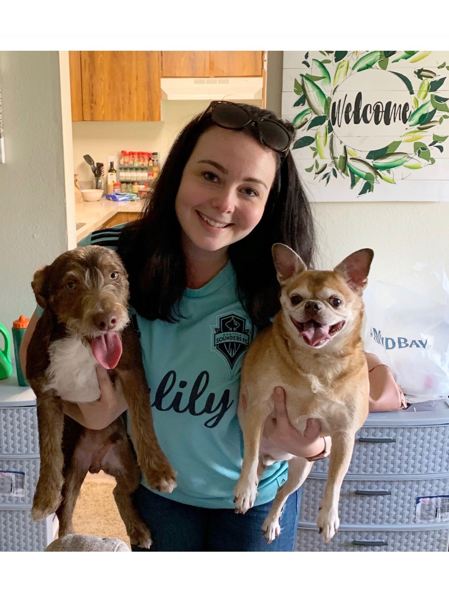

This is my **learning journal**. A page dedicated to my journey down the path of continuous improvement and dedication to a growth mindset! [Check out my portfolio page](https://github.com/breelong7?tab=repositories) for the most up to date content!
Here is a little more about yours truly-
- I absolutely love dogs! I have two of my own, hoping to start a dog rescue one day
- I am part owner of a farm in Wales that was established in the 1600s
- I live in Tacoma and definitely got stuck in traffic driving up to Seattle today!
- I like beer

Contact me any time at **breelong7@gmail.com**
## Now, let's get to the good stuff-

**_"What is a growth mindset?"_** you ask? Well my friend, let me tell you!
A growth mindset is a personal belief that you can do anything you set your mind to! You are not limited based on your current state of talent, skills, or intellect. Your only limitation is the amount of effort you exert.

**_"What are some examples of what I can achieve with a growth mindset?"_** Wow! look at you being all curious. Here's a list of a few really cool things you can achieve with a growth mindset:
1. Learn a new language
2. Learn how to sing, act, create art
3. Become a mathmetician (even if you thought you really hated math!)
4. Become a pilot, astronaut, or even a pro skateboarder!

**_"That all sounds really cool. Where do I even begin?"_** Here are some pro tips for motivating yourself to keep a growth mindset top-of-mind
- Embrace a challenge
- Gives yourself the positive recognition you deserve!
- Be curious & keep an open mind
- Be patient
  - Don't worry if you don't understand something right away. At some point, everyone found themselves in a position where they didn't understand!
- [Visit this site](https://www.prodigygame.com/blog/growth-mindset-in-students/) for more info

## June 19, 2019 Journal Entry
### The Coder's Computer

Today was a bit challenging! I am very new to technical terms when it comes to operating systems, file systems, and things of that nature. I enjoyed learning about the CUI.
VS Code looks like a really great tool for coding! I used it a bit in 101 and I'm excited to learn more about how to utilize it plus the extensions.

### Have you ever pondered the importance of text editors? Want to learn more about terminals? Look no further!~

#### Text Editors 101
Choosing a text editor is no easy task! It boils down to a personal choice, since there are so many great tools out there. 

**So what is a text editor?** A text editor is a type of computer program that edits plain text. Software programmers and web developers use text editors to write and edit in programming and markup languages. This is one of the primary purposes of text editors, and many of the features of text editing software are built to help these users read and write code. The text editor that you choose should be the one that you enjoy the most! As long as it is able to fulfill it's primary purpose to successfully make a website to your satisfaction.

A great feature of any text editing software is code completion. Code completion allows you to start typing, and the code completion feature will display possible suggestions based on what you originally typed.

Another feature you should definitely look into is called syntax highlighting. Syntax highlighting is a feature that takes the text you type, and makes it more noticeable by colorizing the text.

The next feature that you should look for in a text editor is a nice series of themes. These themes will allow you to change the color of the background of your text editor, the series of colors in your text, and sometimes themes will affect other aspects of your text editing software as well. Usually, web developers use a dark background and brightly colored text. This combination seems to be easier on the eyes.

The computers that you purchase will have a built-in text editor (different editors for different operating systems) that you should check out. Keep in mind - most of the built in editors do not have more advanced features like syntax highlighting.

#### All Things Terminals!

A command line, or terminal, is a text based interface to the system. You are able to enter commands by typing them on the keyboard and feedback will be given to you similarly as text.

When you enter commands, they are actually stored in a history. You can traverse this history using the up and down arrow keys. So don't bother re-typing out commands you have previously entered, you can usually just hit the up arrow a few times. You can also edit these commands using the left and right arrow keys to move the cursor where you want.

The **pwd** command (stands for Present Working Directory) is a common command.
The **ls** command is short for list which will give us a list of contents in our current directory if run without arguments.

Files or directories on the command line refer to a path. A path means to get to a particular file or directory on the system.
There are 2 types of paths we can use, absolute and relative. Whenever we refer to a file or directory we are using one of these paths. Whenever we refer to a file or directory, we can, in fact, use either type of path (either way, the system will still be directed to the same location).

t the very top of the structure is what's called the root directory. It is denoted by a single slash ( / ). It has subdirectories, they have subdirectories and so on. Files may reside in any of these directories.

Absolute paths specify a location (file or directory) in relation to the root directory. You can identify them easily as they always begin with a forward slash ( / )

Relative paths specify a location (file or directory) in relation to where we currently are in the system. They will not begin with a slash.

Here are some more building blocks you may use to help build your paths.

~ (tilde) - This is a shortcut for your home directory. eg, if your home directory is /home/ryan then you could refer to the directory Documents with the path /home/ryan/Documents or ~/Documents
. (dot) - This is a reference to your current directory. eg in the example above we referred to Documents on line 4 with a relative path. It could also be written as ./Documents (Normally this extra bit is not required but in later sections we will see where it comes in handy).
.. (dotdot)- This is a reference to the parent directory. You can use this several times in a path to keep going up the hierarchy. eg if you were in the path /home/ryan you could run the command ls ../../ and this would do a listing of the root directory.

## June 21, 2019 Journal Entry

My guide to Git

Git is a distributed version control system (DCVS allows clients to create mirrored repositories to allow greater collaboration efforts). Git relies on local operations which allows for a quick process and the option to continue your work offline.

Files in Git can reside in three main states: committed, modified and staged.

Committed
Data is securely stored in a local database

Modified
File has been changed but not committed to the database

Staged
Flagged a file’s changed version to be committed in the next snapshot

**The local Git repository has three components:**

1. Working Directory: The actual files reside here.
2. Index: The area used for staging
3. Head: Points to the most recent commit

**The Lifecycle of a file status**

1. After you edit a file, Git flags it as modified because of changes made after the previous commit.
2. You stage the modified file.
3. Then, you commit staged changes.

**Check File Status**
To determine the state of files, utilize the git status command:

$ git status
On branch master
nothing to commit, working directory clean

**Tracking and staging a new file**
Single File
Track one file only by using the following format:

git add filename
All Files
Track all files in a repository by using the following command:

$ git add *

**Committing a file**
After staging one or multiple files, you should commit the changes and record what you did within the commit message:

$ git commit -m “made change x,y,z”

Commit all changes
$ git commit -a

Pushing changes
Next, you would push changes to a remote repository. We will discuss remote repositories in more depth in the next section. For now, we will look at a general overview of pushing changes to remotes.

Example:

$ git push origin master

**Git Stash**
When you are not ready to commit changes but do not want to lose them either, git stash is a great option. This command temporarily removes changes and hides them, giving you a clean working directory.

**Fetching**
Fetching entails pulling data that you don’t have from a remote project. git fetch [remote-name]

**Pushing**
To push your changes “upstream” for sharing, you would use the following git push command format:
git push [remote-name][branch-name]

**Renaming**

To rename a remote’s short name, use the git remote rename command.

Example:

$ git remote rename js jane
$ git remote
origin
jane

**Removing**

 remove a remote for whatever reason (e.g., a contributor has left the team, the server has moved), simply use the git remote rm command:

Example:

$ git remote rm jane
$ git remote
origin

**Amend**

You can use the –amend command when you need to alter a commit message or forgot to add some files.

$ git commit --amend

**Undo a committed snapshot**

To undo changes resulting from a particular commit, use the git revert command. This command appends a new commit that undoes changes introduced by a specific commit. This prevents Git from losing history.

$ git commit -m "Example Commit"
$ git revert HEAD

**Unmodify a file**

To have a file return to its state when you last committed, utilize the git checkout command.
Example:

$ git checkout -- index.html

**Branching**

Almost every type of Version Control System incorporates branching. By creating branches of a central repository, collaborators are able to work on a project simultaneously via multiple branches, without affecting this main repository.

A collaborator can create a branch, work on it and save commit snapshots within it, switch between various branches, and merge changes. A Git branch is basically a movable pointer that always points to the most recent commit, or snapshot. Git uses the default local branch name “master,” which can be changed. Just because the default name is “master” does not imply that it is higher in importance or has more functionality than other branches. The head is a special pointer which indicates which branch you are currently working within.

**Create a new branch**

To create a new branch, use the git branch name format:

$ git branch test

**Switch branches**

To switch to another branch, use the git checkout command.

$ git checkout test

*This command moves the HEAD pointer to the test branch*
